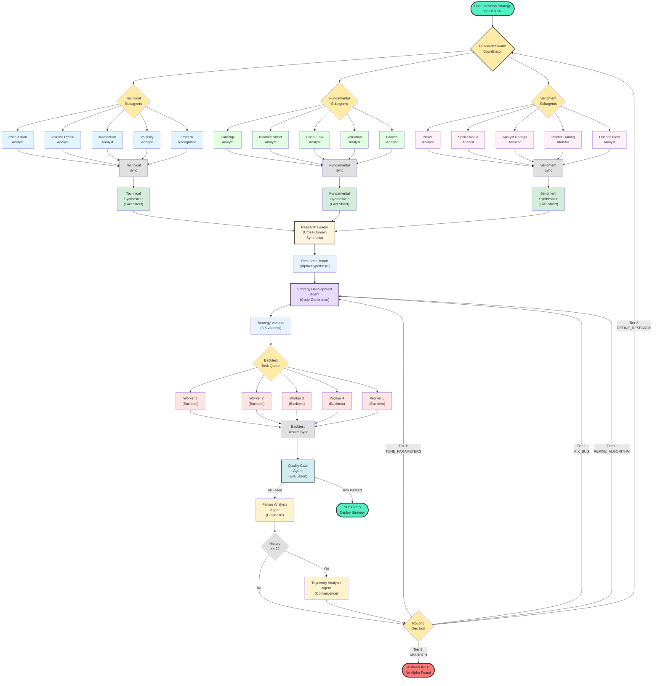

# Research LangChain AlgoTrade Development System

[](docs/design/)
[](LICENSE)

A sophisticated LangChain-based agentic workflow pipeline for systematic algorithmic trading research and development. This system uses state-of-the-art multi-agent orchestration patterns, intelligent feedback loops, experiment tracking, and vector store memory to iteratively develop and validate profitable trading algorithms.

## Project Status

**Phase 1: Core Infrastructure - ✅ COMPLETE**
- LLM routing system with multi-provider failover
- Error handling and validation
- Configuration management
- 31 unit tests passing

**Phase 2: Memory System - 🔄 READY TO START**

See [Project Review and Plan](docs/PROJECT_REVIEW_AND_PLAN.md) for detailed roadmap.

## Key Features

### Core Architecture
- **LangGraph Orchestration**: State-driven multi-agent workflow with 24 specialized agents
- **Hierarchical Research Swarm**: 3-tier architecture (Subagents → Domain Synthesizers → Leader) reduces cognitive load by 70%
- **Multi-Provider LLM Routing**: Automatic failover across OpenAI, Anthropic, Google, Groq using LangChain's `with_fallbacks()`
- **Intelligent Feedback Loops**: Three-tier system (Strategy Refinement → Research Refinement → Abandonment)
- **Parallel Backtesting**: Queue-and-worker pattern for concurrent execution of strategy variants

### Intelligence Systems
- **LLM-Powered Failure Analysis**: Classifies failures into 5 categories (Parameter Issue, Algorithm Bug, Design Flaw, Research Gap, Fundamental Impossibility)
- **Experiment Tracking**: 4-layer system tracks trajectories, detects convergence, analyzes parameter impact
- **Dynamic Quality Gates**: User-defined criteria with fuzzy logic scoring and objective evaluation
- **Parallel Execution**: Queue-based worker pool for concurrent backtesting of multiple strategy variants

### Memory & Tools
- **Vector Store Memory**: ChromaDB-based persistent memory with lineage tracking
- **Tool Development Meta-System**: Generate and validate metric-calculating tools before R&D
- **Systematic Toolchain Validation**: Comprehensive testing framework for tool reliability

### Human Interaction
- **Human-in-the-Loop**: Initial criteria definition with optional ongoing interaction
- **Transparent Decision-Making**: All decisions logged with full rationale

## Architecture Overview

### High-Level Workflow

```
┌─────────────────────────────────────────────────────────────────┐
│                    HUMAN-IN-THE-LOOP PHASE                      │
│  Define: Passing Criteria, Alpha Direction, Risk Tolerance      │
└─────────────────────────────────────────────────────────────────┘
                              │
                              ▼
┌─────────────────────────────────────────────────────────────────┐
│                   TOOL DEVELOPMENT PHASE                        │
│  Metric Tool Generator → Validation → Registry                  │
└─────────────────────────────────────────────────────────────────┘
                              │
                              ▼
┌─────────────────────────────────────────────────────────────────┐
│                   RESEARCH SWARM PHASE                          │
│  Leader Agent → Domain Synthesizers → Subagents                 │
│  (Hierarchical 3-tier synthesis)                                │
└─────────────────────────────────────────────────────────────────┘
                              │
                              ▼
┌─────────────────────────────────────────────────────────────────┐
│                STRATEGY DEVELOPMENT PHASE                       │
│  Formulation → Code Generation → Validation Pipeline            │
│  (Generates N variants for parallel testing)                    │
└─────────────────────────────────────────────────────────────────┘
                              │
                              ▼
┌─────────────────────────────────────────────────────────────────┐
│              BACKTESTING & OPTIMIZATION PHASE                   │
│  Parallel Execution: Queue-and-Worker Pattern                   │
│  ┌──────────┐  ┌──────────┐  ┌──────────┐                      │
│  │ Worker 1 │  │ Worker 2 │  │ Worker 3 │                      │
│  │Variant A │  │Variant B │  │Variant C │                      │
│  └──────────┘  └──────────┘  └──────────┘                      │
│  Backtest → Walk-Forward → Monte Carlo                          │
└─────────────────────────────────────────────────────────────────┘
                              │
                              ▼
┌─────────────────────────────────────────────────────────────────┐
│               QUALITY GATE VALIDATION PHASE                     │
│  ┌─────────────────────────────────────────────────────────┐   │
│  │  1. Evaluate all variants                               │   │
│  │  2. LLM-powered Failure Analysis (if failed)            │   │
│  │  3. Experiment Trajectory Analysis                      │   │
│  │  4. Three-Tier Feedback Loop Routing:                   │   │
│  │     • Tier 1: Strategy Refinement (tune/fix/refine)     │   │
│  │     • Tier 2: Research Refinement (new research)        │   │
│  │     • Tier 3: Abandonment Decision (give up)            │   │
│  └─────────────────────────────────────────────────────────┘   │
└─────────────────────────────────────────────────────────────────┘
```

### LangGraph Workflow Architecture

This diagram shows the complete agentic workflow orchestrated by LangGraph, including all 23 agents and their interactions.



**Agent Count**: 23 agents (15 subagents + 3 synthesizers + 1 leader + 1 strategy dev + 1 quality gate + 1 failure analysis + 1 trajectory analyzer)

**Parallel Execution**: Research swarm (15 subagents) and backtesting (5 workers) run in parallel for maximum efficiency.

See [AGENTIC_SYSTEM_DIAGRAM.md](docs/AGENTIC_SYSTEM_DIAGRAM.md) for detailed legend and workflow explanation.

```
┌─────────────────────────────────────────────────────────────────────────┐
│                    LANGGRAPH STATE-DRIVEN WORKFLOW                      │
├─────────────────────────────────────────────────────────────────────────┤
│                                                                         │
│  Nodes (Agent Invocations):                                             │
│  • research_swarm: Research Swarm Agent (19 agents)                     │
│  • strategy_dev: Strategy Development Agent                             │
│  • parallel_backtest: Async function with queue-and-worker              │
│  • quality_gate: Quality Gate Agent + sub-agents                        │
│                                                                         │
│  State Management (WorkflowState TypedDict):                            │
│  • Research findings, strategy variants, backtest results               │
│  • Iteration counters (strategy, research, total)                       │
│  • Failure analysis, trajectory analysis                                │
│  • Experiment history, best strategy                                    │
│                                                                         │
│  Conditional Routing (Three-Tier Feedback Loops):                       │
│  • SUCCESS → END                                                        │
│  • TUNE/FIX/REFINE → strategy_dev (Tier 1)                              │
│  • RESEARCH → research_swarm (Tier 2)                                   │
│  • ABANDON → END (Tier 3)                                               │
│                                                                         │
│  Parallel Execution (within parallel_backtest node):                    │
│  • Task Queue: Backtest jobs for all variants                           │
│  • Worker Pool: Resource-aware workers                                  │
│  • Automatic retry for failed tasks                                     │
│                                                                         │
└─────────────────────────────────────────────────────────────────────────┘
```

### Intelligence Stack

```
┌─────────────────────────────────────────────────────────────────────────┐
│                    LLM-POWERED FAILURE ANALYSIS                         │
├─────────────────────────────────────────────────────────────────────────┤
│  Classifies failures into 5 categories:                                 │
│  1. PARAMETER_ISSUE: Logic sound, needs tuning                          │
│  2. ALGORITHM_BUG: Implementation error (e.g., incorrect RSI)           │
│  3. DESIGN_FLAW: Missing features (e.g., regime awareness)              │
│  4. RESEARCH_GAP: Insufficient or incorrect research                    │
│  5. FUNDAMENTAL_IMPOSSIBILITY: Alpha doesn't exist                      │
│                                                                         │
│  Provides: Root cause, statistical assessment, specific actions         │
└─────────────────────────────────────────────────────────────────────────┘
                              │
                              ▼
┌─────────────────────────────────────────────────────────────────────────┐
│                    EXPERIMENT TRACKING SYSTEM                           │
├─────────────────────────────────────────────────────────────────────────┤
│  Layer 1: ExperimentLogger (records to JSONL)                           │
│  Layer 2: TrajectoryAnalyzer (computes statistical metrics)             │
│  Layer 3: LLMTrajectoryAnalyzer (interprets patterns)                   │
│  Layer 4: Visualization (generates charts)                              │
│                                                                         │
│  Tracks: Metric trajectories, convergence, parameter impact             │
│  Detects: CONVERGING | DIVERGING | OSCILLATING | STAGNANT               │
│  Recommends: CONTINUE | PIVOT | ABANDON                                 │
└─────────────────────────────────────────────────────────────────────────┘
```

## Technology Stack

| Component | Technology | Purpose |
|-----------|------------|---------|
| Agent Framework | LangChain + LangGraph | Multi-agent orchestration |
| LLM Providers | OpenAI, Anthropic, Google, Groq | Multi-provider with automatic failover |
| LLM Routing | LangChain `with_fallbacks()` | Seamless provider switching |
| Vector Store | ChromaDB | Persistent memory with embeddings |
| Market Data | yfinance | Historical price data |
| Backtesting | Backtrader | Strategy backtesting engine |
| Experiment Tracking | JSONL + Pandas | Trajectory analysis |
| Parallel Execution | asyncio + Queue | Concurrent backtest execution |
| Language | Python 3.11+ | Core implementation |

## Design Decisions

All major design decisions are documented in [Decision Log](docs/DECISION_LOG.md). Key decisions include:

- **D-011**: Hierarchical Synthesis (3-tier architecture)
- **D-013**: Algorithm-Owned Regime Awareness (quality gates stay objective)
- **D-016**: Use LangChain's built-in `with_fallbacks()` (not custom implementation)
- **D-019**: Three-Tier Feedback Loop System
- **D-020**: LLM-Powered Failure Analysis System
- **D-021**: Experiment Tracking System for Trajectory Analysis
- **D-022**: Queue-and-Worker Pattern for Parallel Execution
- **D-023**: LangGraph as Orchestrator (not custom Central Orchestrator)

## Repository Structure

```
research_langchain_algotrade_development_system/
├── docs/
│   ├── design/                      # Design documents
│   │   ├── SYSTEM_DESIGN.md         # Core system design
│   │   ├── AGENT_CATALOG.md         # Complete catalog of 24 agents
│   │   ├── LANGGRAPH_IMPLEMENTATION.md # LangGraph implementation guide
│   │   ├── LANGGRAPH_WORKFLOW_GUIDE.md # LangGraph workflow guide
│   │   ├── HIERARCHICAL_SYNTHESIS.md # 3-tier synthesis architecture
│   │   ├── FEEDBACK_LOOPS.md        # Three-tier feedback loops
│   │   ├── FAILURE_ANALYSIS_SYSTEM.md # LLM-powered failure diagnosis
│   │   ├── EXPERIMENT_TRACKING.md   # Trajectory analysis system
│   │   ├── LLM_ROUTING_SYSTEM.md    # Multi-provider LLM routing
│   │   └── ...                      # Other design docs
│   ├── DECISION_LOG.md              # All design decisions
│   ├── PROJECT_REVIEW_AND_PLAN.md   # Comprehensive project plan
│   ├── PHASE_1_CHECKLIST.md         # Phase 1 acceptance criteria
│   ├── PHASE_2_CHECKLIST.md         # Phase 2 acceptance criteria
│   └── IMPLEMENTATION_GUIDE.md      # Implementation guide
├── src/
│   ├── config/
│   │   ├── llm_credentials.py       # ✅ LLM credential management
│   │   └── settings.py              # ✅ Application settings
│   ├── core/
│   │   ├── llm_client.py            # ✅ LLM factory functions
│   │   ├── error_handler.py         # ✅ Error handling system
│   │   ├── logging.py               # ✅ Logging configuration
│   │   └── base_agent.py            # Base agent class
│   ├── workflows/                   # LangGraph workflows (Phase 9)
│   │   ├── workflow.py              # Main LangGraph workflow
│   │   ├── state.py                 # WorkflowState schema
│   │   ├── task_queue.py            # Task queue for parallel backtests
│   │   └── worker_pool.py           # Worker pool for parallel execution
│   ├── memory/                      # Memory system (Phase 2)
│   │   ├── memory_manager.py        # ChromaDB integration
│   │   └── lineage_tracker.py       # Lineage tracking
│   ├── agents/                      # Agent implementations (Phase 5)
│   │   ├── research_swarm/          # Research swarm agents
│   │   ├── strategy_dev/            # Strategy development agents
│   │   └── quality_gate/            # Quality gate agents
│   ├── tools/                       # Tool registry (Phase 3)
│   └── utils/                       # Utility functions
├── tests/
│   ├── unit/                        # ✅ 31 unit tests passing
│   │   ├── test_llm_credentials.py  # ✅ 11 tests
│   │   ├── test_llm_client.py       # ✅ 10 tests
│   │   └── test_error_handler.py    # ✅ 10 tests
│   ├── integration/                 # ✅ 3 integration tests
│   │   └── test_phase1_integration.py
│   └── e2e/                         # End-to-end tests (Phase 10)
├── experiments/                     # Experiment logs (JSONL files)
├── .env.example                     # ✅ Environment template
├── requirements.txt                 # ✅ Python dependencies
└── README.md                        # This file
```

## Quick Start

### Prerequisites

```bash
# Python 3.11+
python --version

# Install dependencies
pip install -r requirements.txt
```

### Configuration

```bash
# Copy environment template
cp .env.example .env

# Add your API keys
# At minimum, add one LLM provider:
OPENAI_API_KEY=sk-...
# OR
ANTHROPIC_API_KEY=sk-ant-...
# OR
GOOGLE_API_KEY=AIza...
```

### Usage (Phase 1 Complete)

```python
from src.core.llm_client import create_llm_with_fallbacks

# Create LLM with automatic failover
llm = create_llm_with_fallbacks()

# Use in your agents
response = llm.invoke("Analyze AAPL stock for momentum patterns")
```

### Full System Usage (After Phase 10)

```python
from src.workflows.workflow import create_workflow
from src.core.llm_client import create_llm_with_fallbacks

# Create LLM with failover
llm = create_llm_with_fallbacks()

# Create LangGraph workflow
workflow = create_workflow(llm)
app = workflow.compile()

# Define user input
user_input = {
    "ticker": "AAPL",
    "research_directive": "Find momentum alpha in tech stocks",
    "quality_criteria": {
        "sharpe_ratio": 1.0,
        "max_drawdown": 0.20,
        "win_rate": 0.50
    },
    "timeframe": "1d",
    "max_strategy_iterations": 5,
    "max_research_iterations": 3,
    "max_total_iterations": 15
}

# Run workflow
result = app.invoke(user_input)

# Result contains:
# - final_status: "SUCCESS" or "ABANDONED"
# - best_strategy: Strategy code and metrics (if found)
# - experiment_history: All iterations
# - total_iterations: Number of iterations
```

## Documentation

### Core Documentation
- [System Design](docs/design/SYSTEM_DESIGN.md) - Core system architecture
- [Agent Catalog](docs/design/AGENT_CATALOG.md) - Complete catalog of 24 agents
- [Project Review and Plan](docs/PROJECT_REVIEW_AND_PLAN.md) - Comprehensive development plan
- [Decision Log](docs/DECISION_LOG.md) - All design decisions with rationale

### LangGraph Documentation
- [LangGraph Implementation](docs/design/LANGGRAPH_IMPLEMENTATION.md) - Complete implementation guide
- [LangGraph Workflow Guide](docs/design/LANGGRAPH_WORKFLOW_GUIDE.md) - Practical workflow guide

### Architecture Documentation
- [Hierarchical Synthesis](docs/design/HIERARCHICAL_SYNTHESIS.md) - 3-tier research synthesis
- [Feedback Loops](docs/design/FEEDBACK_LOOPS.md) - Three-tier feedback system
- [Failure Analysis](docs/design/FAILURE_ANALYSIS_SYSTEM.md) - LLM-powered diagnosis
- [Experiment Tracking](docs/design/EXPERIMENT_TRACKING.md) - Trajectory analysis
- [LLM Routing](docs/design/LLM_ROUTING_SYSTEM.md) - Multi-provider failover

### Implementation Documentation
- [Phase 1 Checklist](docs/PHASE_1_CHECKLIST.md) - Core infrastructure (✅ COMPLETE)
- [Phase 2 Checklist](docs/PHASE_2_CHECKLIST.md) - Memory system (🔄 READY)
- [Implementation Guide](docs/IMPLEMENTATION_GUIDE.md) - Implementation details
- [LLM Configuration Guide](docs/LLM_CONFIGURATION_GUIDE.md) - LLM setup guide

## Development Roadmap

### ✅ Phase 1: Core Infrastructure (COMPLETE)
- LLM routing with multi-provider failover
- Error handling and validation
- Configuration management
- **Status**: 31 unit tests passing, 100% complete

### 🔄 Phase 2: Memory System (READY TO START)
- ChromaDB integration
- Research findings storage
- Strategy library
- Lineage tracking
- **Estimated**: 3.5 days

### ⏳ Phases 3-10 (NOT STARTED)
See [Project Review and Plan](docs/PROJECT_REVIEW_AND_PLAN.md) for detailed roadmap.

**Total Estimated Time**: 37.5 days (8 weeks)

## Key Metrics

### Performance Targets
- Strategy development time: < 1 hour
- Parallel speedup: 3-10x (depending on variants)
- Strategy Sharpe ratio: > 1.5
- Strategy max drawdown: < 15%
- Human intervention rate: < 20%

### System Metrics
- LLM provider failover: < 1 second
- Experiment tracking overhead: < 5%
- Memory query latency: < 500ms
- Concurrent backtests: 5-10 (configurable)

## Contributing

This project is in active development. Contributions are welcome!

1. Fork the repository
2. Create a feature branch
3. Make your changes
4. Add tests
5. Submit a pull request

See [CONTRIBUTING.md](CONTRIBUTING.md) for detailed guidelines.

## License

MIT License - see [LICENSE](LICENSE) for details.

## Acknowledgments

- **LangChain/LangGraph**: Multi-agent orchestration framework
- **Anthropic**: Multi-agent research system architecture patterns
- **OpenAI Swarm**: Swarm framework patterns
- **Backtrader**: Backtesting engine
- **ChromaDB**: Vector store for semantic memory

## Contact

For questions or discussions, please open an issue on GitHub.

---

**Built with ❤️ using LangChain, designed for systematic algorithmic trading research**
