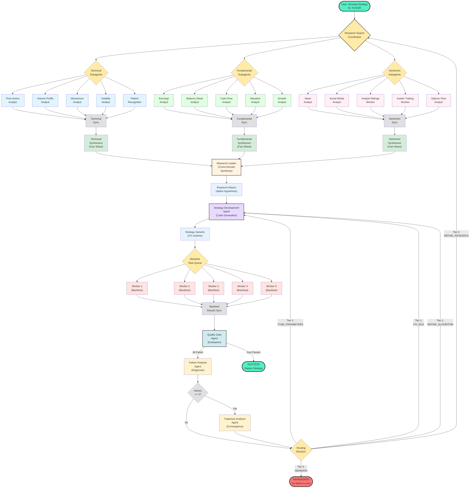

# Agentic System Architecture Diagram

## LangChain Algorithmic Trading Development System

This diagram shows the complete agentic workflow orchestrated by LangGraph.

## Legend

### Node Types

| Color | Type | Examples |
|-------|------|----------|
| 🟢 Green | Entry/Exit Points | Start, Success, Abandon |
| 🟡 Yellow | Coordinators/Dispatchers | Research Swarm, Routing Decision |
| 🔵 Blue | Technical Agents | Price Action, Volume Profile, Momentum |
| 🟢 Light Green | Fundamental Agents | Earnings, Balance Sheet, Cash Flow |
| 🌸 Pink | Sentiment Agents | News, Social Media, Analyst Ratings |
| 🟤 Gray | Sync Points | Technical Sync, Backtest Sync |
| 🟢 Light Green | Synthesizers | Technical/Fundamental/Sentiment Synthesizers |
| 🟡 Light Yellow | Primary Agents | Research Leader, Strategy Dev, Quality Gate |
| 🟠 Orange | Workers | Backtest Workers 1-5 |
| 🔵 Light Blue | Intermediate Outputs | Research Report, Strategy Variants |
| 🟡 Light Yellow | Sub-Agents | Failure Analysis, Trajectory Analyzer |

### Workflow Phases

1. **Research Swarm Phase** (19 agents)
   - **Tier 1**: 15 subagents run in parallel (5 technical + 5 fundamental + 5 sentiment)
   - **Tier 2**: 3 domain synthesizers produce Fact Sheets
   - **Tier 3**: 1 research leader performs cross-domain synthesis

2. **Strategy Development Phase** (1 agent)
   - Generates 3-5 strategy variants based on research findings
   - Each variant has different parameters or approaches

3. **Parallel Backtesting Phase** (Queue-and-Worker)
   - Task queue holds all backtest tasks
   - 5 workers execute backtests in parallel
   - Results synchronized after all complete

4. **Quality Gate Phase** (3 agents)
   - Quality Gate Agent evaluates all variants
   - If all fail → Failure Analysis Agent diagnoses root cause
   - If history >= 2 → Trajectory Analyzer Agent checks convergence
   - Routing Decision determines next action

### Three-Tier Feedback Loops

| Tier | Trigger | Action | Destination |
|------|---------|--------|-------------|
| **Tier 1** | Fixable issues | TUNE_PARAMETERS, FIX_BUG, REFINE_ALGORITHM | Strategy Development |
| **Tier 2** | Wrong hypothesis | REFINE_RESEARCH | Research Swarm |
| **Tier 3** | No alpha exists | ABANDON | End workflow |

### Agent Count Summary

| Category | Count | Details |
|----------|-------|---------|
| **Research Subagents** | 15 | 5 technical + 5 fundamental + 5 sentiment |
| **Domain Synthesizers** | 3 | Technical, Fundamental, Sentiment |
| **Research Leader** | 1 | Cross-domain synthesis |
| **Strategy Development** | 1 | Code generation |
| **Quality Gate** | 1 | Evaluation |
| **Failure Analysis** | 1 | Diagnosis |
| **Trajectory Analyzer** | 1 | Convergence analysis |
| **Total Agents** | 23 | (Workers are not agents) |

### Parallel Execution Points

1. **Research Swarm Tier 1**: 15 subagents run in parallel
2. **Backtesting**: 5 workers execute backtests in parallel
3. **Domain Synthesizers**: 3 synthesizers can run in parallel (optional optimization)

### Key Design Decisions

- **LangGraph orchestrates the workflow** (not custom orchestrator)
- **Hierarchical synthesis** reduces cognitive load on Research Leader
- **Queue-and-worker pattern** enables scalable parallel backtesting
- **Three-tier feedback loops** prevent endless iteration
- **LLM-powered failure analysis** provides intelligent routing decisions
- **Experiment tracking** enables trajectory analysis and convergence detection

---

**Document**: Agentic System Architecture Diagram  
**Created**: 2026-01-18  
**Status**: Complete
